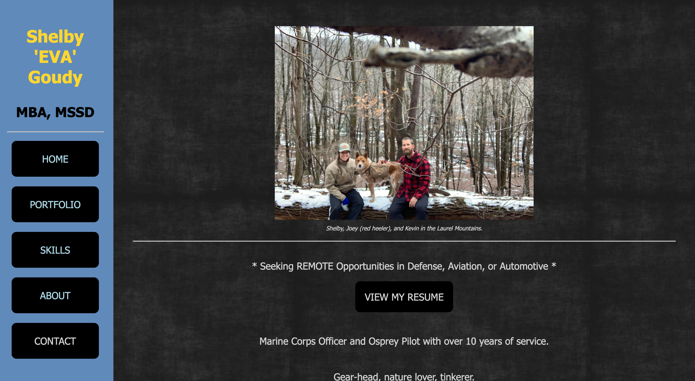

https://sgoudy.netlify.app



# cs601_HW6_goudy

Brand new Vue user but I've started implementing it here for the purpose of building out my final project!

## Part 1: JSON
There are two JSON files (`portfolioData.json & schoolData.json`, located in the `public` folder).
I access `data.json` in the config file to dynamically render my school data table on the About page.  

## Part 2: JSON and Fetch
Fetching is implemented on the About page and Portfolio page via Button Click!

## Project setup
```
npm install
```

### Compiles and hot-reloads for development
```
npm run serve
```

### Compiles and minifies for production
```
npm run build
```

### Lints and fixes files
```
npm run lint
```

### Customize configuration
See [Configuration Reference](https://cli.vuejs.org/config/).
